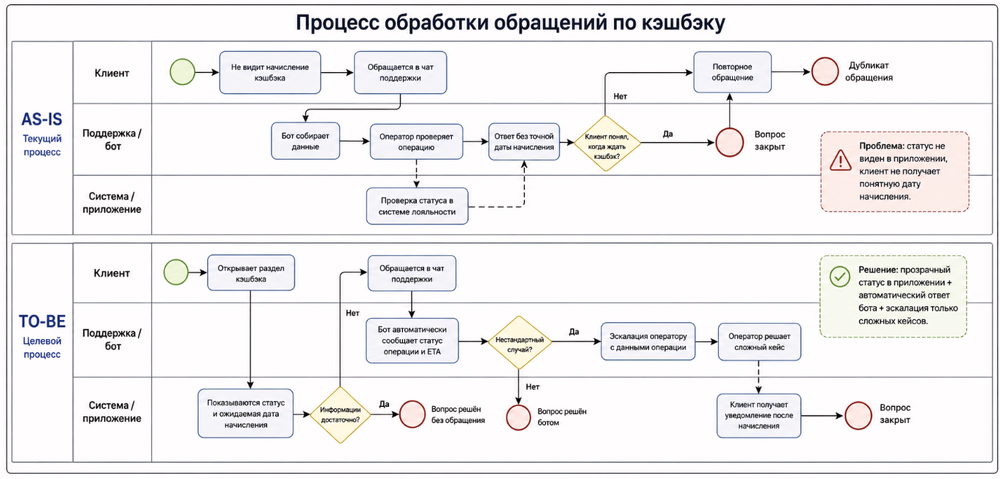

# cashback-support-process
BPM case: analysis and optimization of the cashback support process.

## Снижение повторных обращений клиентов по вопросам начисления кэшбэка

Цель проекта:
Выявить причины повторных обращений клиентов в поддержку по вопросам начисления кэшбэка и предложить изменения бизнес-процесса, которые сократят нагрузку на операторов и улучшат клиентский опыт.

Задача:
Проанализировать обращения клиентов, операции по кэшбэку и этапы обработки запросов. Определить, на каких сценариях клиенты чаще возвращаются с повторным вопросом, и разработать целевой процесс обработки обращений.

Инструменты:
PostgreSQL, SQL, BPMN, Python.

Данные:
Синтетический учебный набор данных, имитирующий операции начисления кэшбэка и обращения клиентов в поддержку.

Основные метрики:
— доля повторных обращений
— количество обращений на 1000 операций по кэшбэку
— среднее время решения обращения
— доля обращений, решённых без оператора
— наиболее частые причины повторного обращения.

## BPMN-схема процесса

### Основные выводы

- 20% обращений являются повторными.
- Повторные обращения возникают при задержанном или ожидаемом кэшбэке, если клиент не видит статус операции в приложении.
- Бот отвечает в среднем за 5 минут и закрывает вопрос за 30 минут.
- Оператор отвечает в среднем за 35 минут и закрывает обращение за 360 минут.

### Предложенное улучшение

Показывать клиенту статус кэшбэка и ожидаемую дату начисления в приложении. Типовые вопросы должен автоматически закрывать бот, а оператору нужно передавать только нестандартные случаи вместе с данными операции.